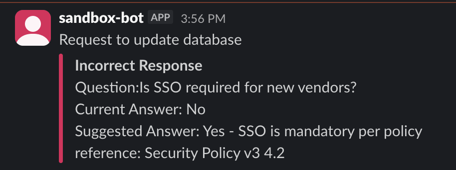

# Recipe `123804080` — post a "response correction" card (LIVE Slack)

**Connector:** Slack (live) &nbsp;|&nbsp; **Trigger:** `workato_genie::start_workflow` &nbsp;|&nbsp; **Op:** `slack_bot::post_bot_message`

## What it does
A Genie workflow supplies a Q&A (`question`, `answer`, `suggested_answer`, `reference`). The recipe
posts a Slack message with a red **"Incorrect Response"** attachment containing those values.

## Input supplied
```json
{ "trigger": { "parameters": {
  "question": "Is SSO required for new vendors?",
  "answer": "No",
  "suggested_answer": "Yes - SSO is mandatory per policy",
  "reference": "Security Policy v3 4.2"
}}}
```

## Run command
```bash
cd ~/Desktop
python3 test_sandbox/run.py 123804080 --live --input /tmp/s2_slack1.json
```


## Live result ✅
- `status: completed`; side-effect `slack_bot::post_bot_message` → `ok: true`, `ts: 1781045768.117879`
- Posted to **`#sandbox`** (`C0B95EM1PC1`), redirected from the recipe's hard-coded channel `C093S3NDLH2`.
- Renders as text "Request to update database" + a red attachment titled **"Incorrect Response"** with the Question / Current Answer / Suggested Answer / reference lines.

**Proves:** the live Slack connector (a) **redirects** foreign channel ids to `#sandbox`
(`SLACK_CHANNEL_OVERRIDE`), and (b) **translates** Workato's attachment format into a real Slack
message. `ts` is Slack's real message id.
