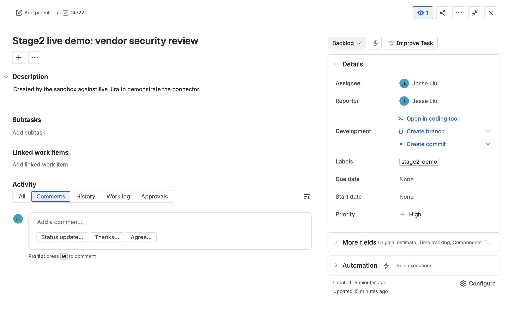

# Recipe `127910849` — create a Jira Task (LIVE Jira)

**Connector:** Jira (live) &nbsp;|&nbsp; **Trigger:** `workato_genie::start_workflow` &nbsp;|&nbsp; **Op:** `jira::create_issue`

## What it does
A Genie workflow supplies parameters (`summary`, `description`, `priority`, `label`); the recipe
calls `create_issue` to open a **Jira Task** in the `GL` project with those values.

## Input supplied
```json
{ "trigger": { "parameters": {
  "summary": "Stage2 live demo: vendor security review",
  "description": "Created by the sandbox against live Jira to demonstrate the connector.",
  "priority": "High",
  "label": "stage2-demo"
}}}
```

## Run command
```bash
cd ~/Desktop
python3 test_sandbox/run.py 127910849 --live --input /tmp/s2_jira1.json
```



## Live result ✅
- `status: completed`; side-effect `jira::create_issue` → `key: GL-22`
- Created in Jira: **[GL-22](https://test-sandbox-dev.atlassian.net/browse/GL-22)**
  - Type **Task**, Priority **High**, Status **Backlog**
  - Summary = exactly the input; Description = the input

**Proves:** the live Jira connector takes recipe datapills → a real, correctly-populated issue in
`test-sandbox-dev.atlassian.net`.
