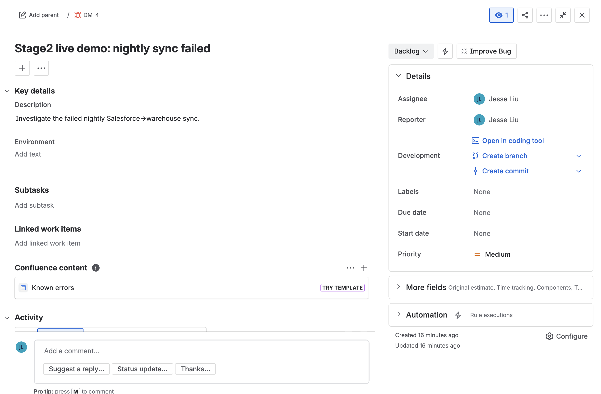
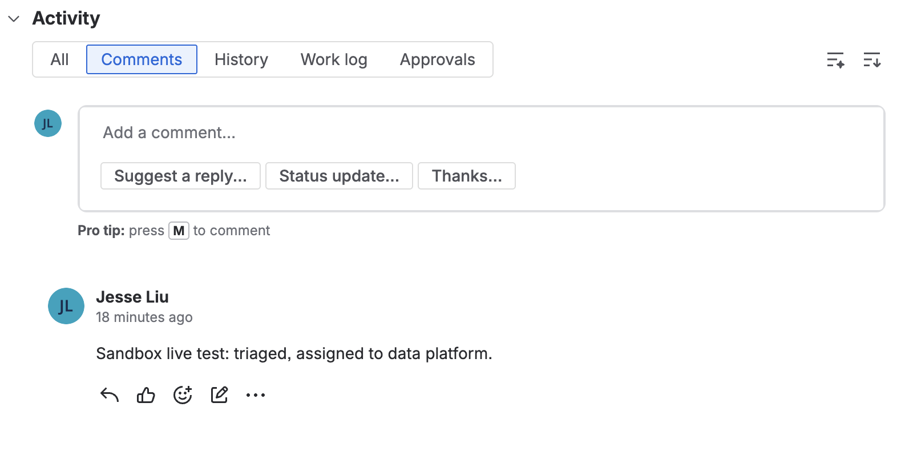

# Recipe `129427781` — create a Jira Bug + comment (LIVE Jira)

**Connector:** Jira (live) &nbsp;|&nbsp; **Trigger:** `workato_genie::start_workflow` &nbsp;|&nbsp; **Ops:** `jira::create_issue`, `jira::create_comment`

## What it does
A Genie workflow supplies issue fields plus a comment body. The recipe **creates a Jira Bug** in
the `DM` project, then **adds a comment** to the freshly-created issue (the comment's `key` is the
new issue's key — a real step-to-step datapill).

## Input supplied
```json
{ "trigger": { "parameters": {
  "summary": "Stage2 live demo: nightly sync failed",
  "description": "Investigate the failed nightly Salesforce->warehouse sync.",
  "priority": "Medium",
  "conversation": "Sandbox live test: triaged, assigned to data platform."
}}}
```

## Run command
```bash
cd ~/Desktop
python3 test_sandbox/run.py 129427781 --live --input /tmp/s2_jira2.json
```




## Live result ✅
- `status: completed`; side-effects: `jira::create_issue` → `key: DM-4`, then `jira::create_comment` → `key: DM-4`
- Created in Jira: **[DM-4](https://test-sandbox-dev.atlassian.net/browse/DM-4)**
  - Type **Bug**, Priority **Medium**, Status **Backlog**
  - **1 comment**: *"Sandbox live test: triaged, assigned to data platform."*

**Proves:** the live connector does a **multi-step** real flow — create an issue, then act on it
(comment) using the returned key. Two real Jira API writes in one recipe.
