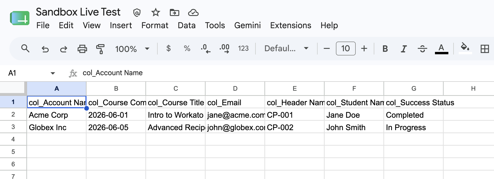

# Recipe `131400470` — append rows to Google Sheets (LIVE Google Sheets)

**Connector:** Google Sheets (live) &nbsp;|&nbsp; **Trigger:** `salesforce::sobject_batch_created_or_updated` &nbsp;|&nbsp; **Op:** `google_sheets::add_row_v4_bulk`

> The 4th live connector. A batch of records → real rows appended to a real Google Sheet.
> You supply the batch as input; the recipe maps each record's fields to columns and appends.

## What it does
A batch trigger delivers `skilljar__Course_Progress__c` records; the recipe maps each record's
fields to columns and **appends them to a Google Sheet** (`add_row_v4_bulk`). All appends redirect
to your configured spreadsheet (recipes carry foreign sheet ids).

---

## Prerequisites (one-time)
1. **gcloud authed with the Drive scope** (the `spreadsheets` scope is blocked on the ADC client):
   ```bash
   gcloud auth login --enable-gdrive-access
   gcloud services enable sheets.googleapis.com
   ```
2. **`.env`** has the target sheet (already set):
   ```
   SHEETS_SPREADSHEET_ID=1za81dIH79JpmD15kAxpM-EtiMdWBmUsU_HIX_EshNh0
   SHEETS_TAB=Sheet1
   ```
Confirm `run.py --live` prints `... google_sheets` in the "live providers" line.

## Steps

### Step 1 — (optional) clear the sheet for a clean view
```bash
cd ~/Desktop
python3 -c "
import sys; sys.path.insert(0,'/Users/jesseliu/Desktop')
from test_sandbox.google_sheets_live import SheetsClient
c=SheetsClient.from_env(); c._req('POST','/spreadsheets/%s/values/%s:clear'%(c.spreadsheet_id,c.tab)); print('cleared')
"
```

jesseliu@mac test_sandbox % cd ~/Desktop
python3 -c "
import sys; sys.path.insert(0,'/Users/jesseliu/Desktop')
from test_sandbox.google_sheets_live import SheetsClient
c=SheetsClient.from_env(); c._req('POST','/spreadsheets/%s/values/%s:clear'%(c.spreadsheet_id,c.tab)); print('cleared')
"
cleared

### Step 2 — build the input batch
Columns map to nested record fields (`Account__r.Name`, `skilljar__Course__r.skilljar__Title__c`,
`skilljar__Student__r.skilljar__Email__c`, …), so shape the rows to match:
```bash
cat > /tmp/s2_sheet.json <<'EOF'
{ "trigger": { "skilljar__Course_Progress__c": [
  {"Name":"CP-001","skilljar__Completed_At__c":"2026-06-01","skilljar__Success_Status__c":"Completed",
   "Account__r":{"Name":"Acme Corp"},
   "skilljar__Course__r":{"skilljar__Title__c":"Intro to Workato"},
   "skilljar__Student__r":{"Name":"Jane Doe","skilljar__Email__c":"jane@acme.com"}},
  {"Name":"CP-002","skilljar__Completed_At__c":"2026-06-05","skilljar__Success_Status__c":"In Progress",
   "Account__r":{"Name":"Globex Inc"},
   "skilljar__Course__r":{"skilljar__Title__c":"Advanced Recipes"},
   "skilljar__Student__r":{"Name":"John Smith","skilljar__Email__c":"john@globex.com"}}
]}}
EOF
```

### Step 3 — run the recipe live
```bash
python3 test_sandbox/run.py 131400470 --live --input /tmp/s2_sheet.json
```
**Expect:** `status: completed` and a `google_sheets::add_row_v4_bulk` side-effect with `appended: 2`.

{
  "id": "131400470",
  "status": "completed",
  "steps": 3,
  "side_effects": [
    {
      "provider": "google_sheets",
      "operation": "add_row_v4_bulk",
      "data": {
        "spreadsheet": "1za81dIH79JpmD15kAxpM-EtiMdWBmUsU_HIX_EshNh0",
        "tab": "Sheet1",
        "appended": 2,
        "columns": [
          "col_Account Name",
          "col_Course Completion Date",
          "col_Course Title",
          "col_Email",
          "col_Header Name",
          "col_Student Name",
          "col_Success Status"
        ]
      }
    }
  ],
  "formula_errors": [],
  "sample": 0,
  "trigger_fired": {
    "skilljar__Course_Progress__c": [
      {
        "Name": "CP-001",
        "skilljar__Completed_At__c": "2026-06-01",
        "skilljar__Success_Status__c": "Completed",
        "Account__r": {
          "Name": "Acme Corp"
        },
        "skilljar__Course__r": {
          "skilljar__Title__c": "Intro to Workato"
        },
        "skilljar__Student__r": {
          "Name": "Jane Doe",
          "skilljar__Email__c": "jane@acme.com"
        }
      },
      {
        "Name": "CP-002",
        "skilljar__Completed_At__c": "2026-06-05",
        "skilljar__Success_Status__c": "In Progress",
        "Account__r": {
          "Name": "Globex Inc"
        },
        "skilljar__Course__r": {
          "skilljar__Title__c": "Advanced Recipes"
        },
        "skilljar__Student__r": {
          "Name": "John Smith",
          "skilljar__Email__c": "john@globex.com"
        }
      }
    ]
  }
}

### Step 4 — verify (read the sheet back, or open it)
```bash
python3 -c "
import sys; sys.path.insert(0,'/Users/jesseliu/Desktop')
from test_sandbox.google_sheets_live import SheetsClient
for row in SheetsClient.from_env().get_values(): print(row)
"
```
Or open it in the browser:
**https://docs.google.com/spreadsheets/d/1za81dIH79JpmD15kAxpM-EtiMdWBmUsU_HIX_EshNh0/edit**

You should see a header row + your 2 rows:

| Account Name | Completion Date | Course Title | Email | Header Name | Student Name | Success Status |
|---|---|---|---|---|---|---|
| Acme Corp | 2026-06-01 | Intro to Workato | jane@acme.com | CP-001 | Jane Doe | Completed |
| Globex Inc | 2026-06-05 | Advanced Recipes | john@globex.com | CP-002 | John Smith | In Progress |


---

## Results (fill in after you run it)
- **Date run:** &nbsp; **status:** &nbsp; **rows appended:**
- **Sheet shows the rows?** ☐ yes (screenshot) ☐ no
- **Notes:**
