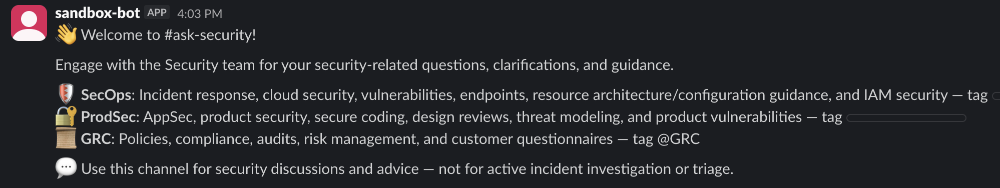

# Recipe `131610736` — post a Block Kit welcome card (LIVE Slack)

**Connector:** Slack (live) &nbsp;|&nbsp; **Trigger:** `clock::scheduled_event` &nbsp;|&nbsp; **Op:** `slack_bot::post_bot_message`

## What it does
A scheduled recipe posts a rich **Block Kit** message — a "Welcome to #ask-security!" card built
from Workato's block DSL (`section_with_text`, `divider`, `context`, …).

## Run command (no input needed — scheduled trigger fabricated)
```bash
cd ~/Desktop
python3 test_sandbox/run.py 131610736 --live
```



## Live result ✅
- `status: completed`; side-effect `slack_bot::post_bot_message` → `ok: true`, `ts: 1781046224.787059`
- Posted to **`#sandbox`** (`C0B95EM1PC1`), redirected from the recipe's channel `C09HQ4E4YRZ`.
- Renders as a formatted card beginning **"👋 Welcome to #ask-security!"** with sections/dividers.

**Proves:** the live Slack connector translates a recipe's **Block Kit** layout (not just plain
text) into a real, formatted Slack message — `live/slack.py:_to_slack_blocks` converting Workato's
`block_type` DSL into Slack's native blocks.

> Contrast: recipe `109210865` builds a message whose datapills resolve to only invisible spacer
> characters, so the handler **skips** it (`empty_message_skipped`, `ok:false`) rather than posting
> a blank — a deliberate guard, also part of the live behavior.
