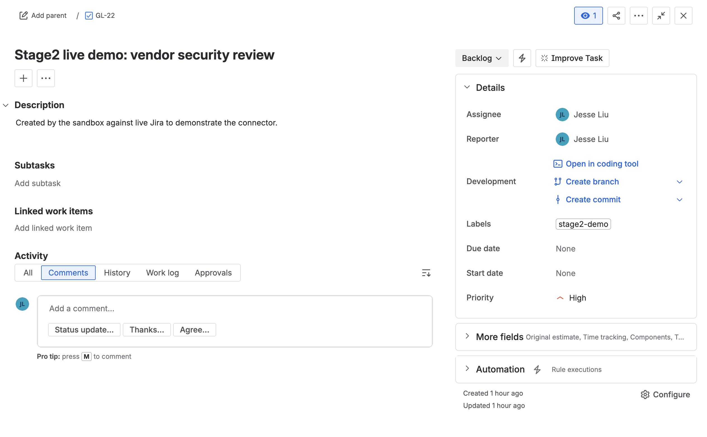

# Recipe `131739423` — read a Jira issue (LIVE Jira, read)

**Connector:** Jira (live) &nbsp;|&nbsp; **Trigger:** `workato_genie::start_workflow` &nbsp;|&nbsp; **Op:** `jira::get_issue`

## What it does
A Genie workflow supplies an issue key; the recipe calls `get_issue` to **read that Jira issue
live** and returns its fields to the workflow. (A read, not a write.)

## Input supplied
```json
{ "trigger": { "parameters": { "issuekey": "GL-22" } } }
```
*(`GL-22` is the issue created by recipe `127910849`.)*

## Run command
```bash
cd ~/Desktop
python3 test_sandbox/run.py 131739423 --live --input /tmp/s2_jget.json
```



## Live result ✅
- `status: completed`. `get_issue` is a read (no write side-effect), but the workflow's
  `return_result` payload carries the **real fields of GL-22** — e.g. its description
  *"Created by the sandbox against live Jira to demonstrate the connector."*
- Verified directly: `get_issue('GL-22')` → summary *"Stage2 live demo: vendor security review"*.

**Proves:** the live Jira connector performs real **reads** — datapill (issue key) → live
GET → the issue's actual field values flow downstream into the recipe.
